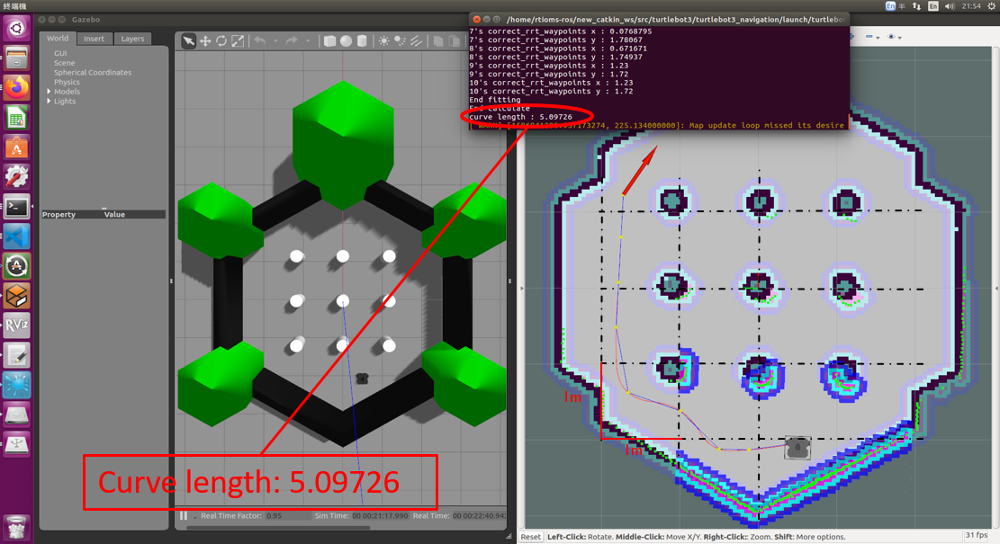
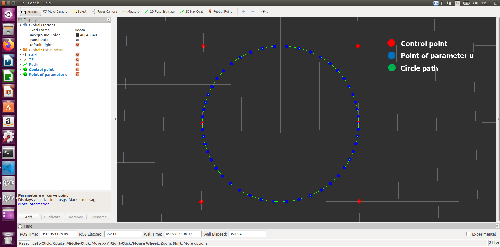
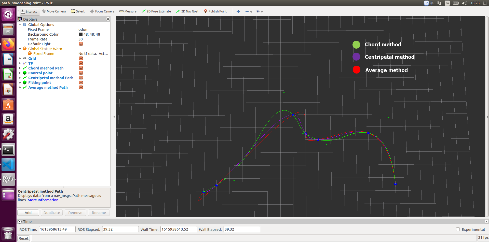

# agv path smoothing - A generating/fitting specified NURBS curve ros package
This is a ROS package developed NURBS method for path smoothing in autonomous mobile robot navigation to avoid global planners generated path which has many sharp turns. The NURBS(Non-Uniform Rational B-Spline) curve, consist of control point, knot vector and weight vector, is parameter curve that can let curve curvature continuity and with high degree of freedom to modify curve. 

The main features include:
* Implemented the generate Line, Bezier, B-spline and NURBS curve.
* Implemented the global interpolation method (see [reference](#reference)) to fit discrete waypoints. 
* Implemented useful function for motion planning to use, such as calculation NURBS curve derivative, curvature, curve length and so on.  
* Implemented limited fitting function let the mobile robot do not need to rotate in place when navigating.



The package is under development, some future works are listing below:
* Knot insert function
* Collision checking
* Real time control point repositioning (path modification)
* Extend to 3D NURBS curve.

# Installation
This package based on Eigen library to development, so please install eigen library first.
```shell
sudo apt-get install libeigen3-dev
```
Next, clone this repository to your catkin workspace and catkin build this package.
```shell
cd ~/catkin_ws/src
glt clone https://github.com/q576333/agv_path_smoothing
catkin build
```
# Usage
## Gerenting NURBS curve example
Setting control point, knot vector and weight vector in launch file
```html
<rosparam param="control_point" > [0, 0, 0, -2, 4, -2, 4, 0, 4, 2, 0, 2, 0, 0]</rosparam> 
<rosparam param="knot_vector" > [0, 0, 0, 0.25, 0.5, 0.5, 0.75, 1, 1, 1]</rosparam>
<rosparam param="weight_vector" > [1, 0.5, 0.5, 1, 0.5, 0.5, 1]</rosparam>
```
Running
```shell
roslaunch agv_path_smoothing spline_visualization.launch
```


## Fitting waypoints to NURBS curve example
Setting discrete waypoints and weight vector in launch file
```html
<rosparam param="fitting_point" > [-6, -3, -5, -2.5, 1, 3, 2, 1.5, 3, 1, 7, 1.5, 9, -2.5]</rosparam>
<rosparam param="weight_vector" > [1, 1, 1, 1, 1, 1, 1]</rosparam>
```
Running
```shell
roslaunch agv_path_smoothing fitting_test.launch
```


# Reference 
* "The NURBS Book" Les Piegl and Wayne Tiller, 2nd edn., Springer, 1997.
